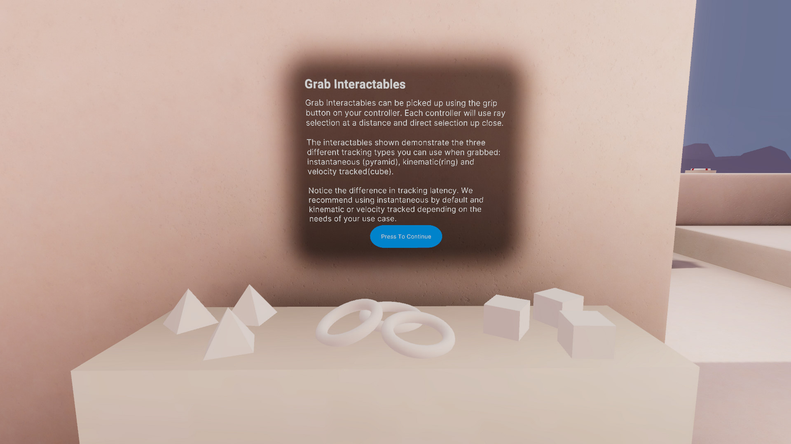
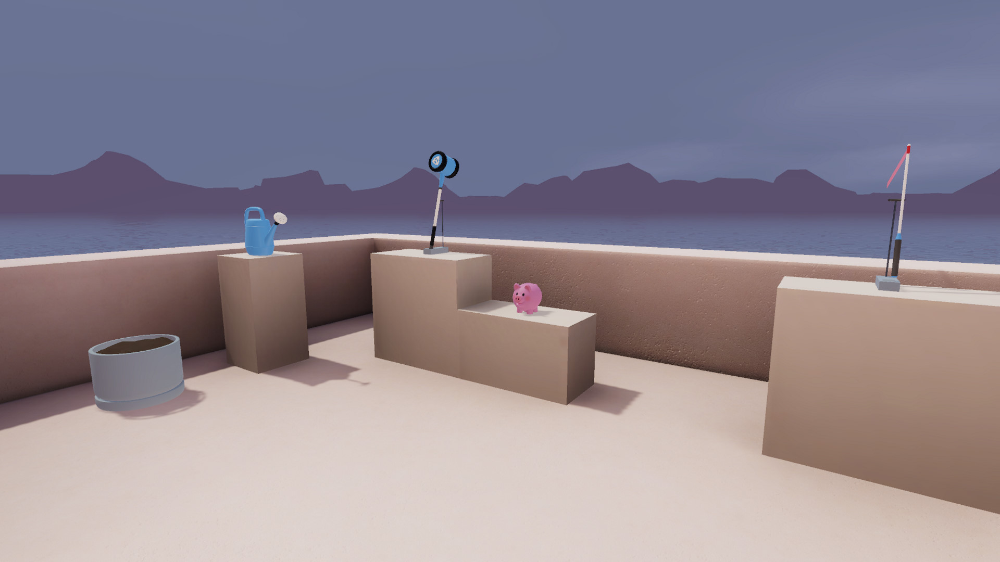

# Grab Interactables

## Station descriptor

Grab Interactables can be picked up using the grip button on your controller. Each controller will use ray selection at a distance and direct selection up close.

The interactables shown demonstrate the three different tracking types you can use when grabbed: instantaneous (pyramid), kinematic(ring) and velocity tracked(cube).

Notice the difference in tracking latency. We recommend using instantaneous by default and kinematic or velocity tracked depending on the needs of your use case.

## Basic examples

Each interactable example contains the required components for grabbing; a **Rigidbody**, **XR Grab Interactable**, and **Collider**.

In addition, each example object contains a child Prefab named **HoverStateVisuals**. This is a helper we've included that will automatically highlight interactables when they are hovered along with providing haptic and audio feedback. Three variants are included, which have different levels of effects included when the activate button is pressed. These can be added to your own objects to automatically get hover-highlight support.

The major difference between the example objects is the movement type selected.
* **Instantaneous** movement is for objects that do not need to interact with other physics objects.
* **Kinematic** similarly moves objects instantly and can interact better with physics objects. However, as these objects move instantly, they can exert unrealistic levels of force on physics objects.
* **VelocityTracked** objects react more naturally with other physics objects in the scene. However, the held objects will have a noticeable latency in their motion when the Fixed Timestep for physics occurs less frequently than the framerate of the application. See [Fixed Timestep (fixedDeltaTime)](https://docs.unity3d.com/Manual/TimeFrameManagement.html).

## Advanced examples

The advanced examples show different uses for grabbed objects in XR. This includes:
* **Watering can**, with included script for detecting tilt (to pour water).

* **Hammer**, which does a simple trigger detection to break the destructible piggy bank.

* **Ribbon-on-a-string**, which demonstrates how cloth simulation can be leveraged to give grabbed objects more life.

